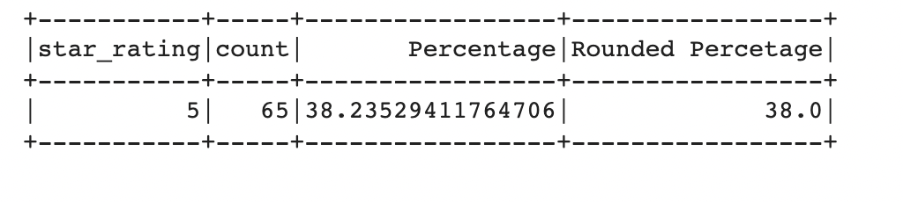
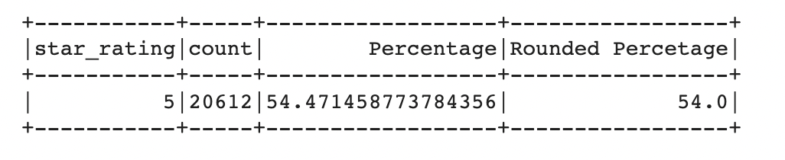

# Amazon_Vine_Analysis

## Overview of the analysis
On this project I analyzed amazon reviews for pet products to see if there is a difference between paid versus unpaid reviews. 

## Results: Using bulleted lists and images of DataFrames as support, address the following questions
- There was a total of 170 paid reviews and 37,840 unpaid reviews for this data set. 

- Of the paid reviews, 65 had a five-star rating which is 38% of the total paid reviews.

- Of the unpaid reviews, 20,612 had a five-star review, which amounts to 55% of total unpaid reviews.

## Summary

Based on the numbers, there is no positivity bias in the reviews for the paid vine program when it comes to pet products. In fact, nonpaid reviewers had more positive ratings than the paid reviewers. It might be interesting to look at how many pet products the paid vs nonpaid reviewers have received via amazon. Since the paid reviewers might get a lot of products, they might have higher standards as compared to the nonpaid if it is the first pet product they have received from amazon. 